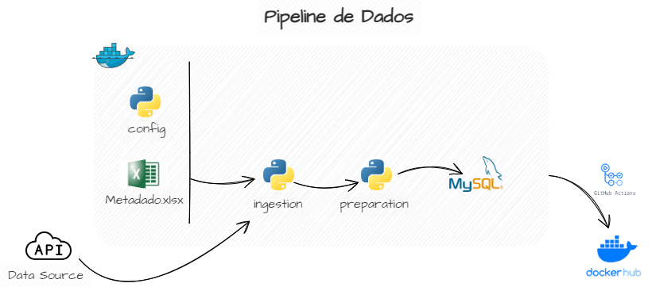

# Documentação do Projeto

Este repositório contém o projeto da disciplina de DataOps que implementa um pipeline de dados




## Pré-requisitos

Antes de começar, certifique-se de ter o Git e o Docker instalados no seu sistema.

- [Git](https://git-scm.com/book/en/v2/Getting-Started-Installing-Git)
- [Docker](https://docs.docker.com/engine/install/)
- [Docker Composer](https://docs.docker.com/compose/install/)

## Como Usar (Linux)

### Clonar o Repositório

1. Abra o terminal ou o prompt de comando.

2. Navegue até o diretório onde deseja clonar o repositório.

3. Execute o seguinte comando:

    ```
    git clone https://github.com/cristianefleal/de-dataops.git
    ```

### Configurar e executar o docker compose

4. Navegue até o diretório raiz do projeto após clonar o repositório:

    ```
    cd de-dataops
    ```
5. Crie o arquivo .env de acordo com a estrutura de .env.local:

    ```
    cp .env.local .env
    ```
6. Edite o arquivo .env atribuindo valor às variáveis:

    ``` 
    URL=
    MYSQL_DATABASE=
    MYSQL_ROOT_PASSWORD=
    MYSQL_USER=
    ```

7. Execute o seguinte comando para inicializar os serviços:

    ```
    docker compose up
    ```

